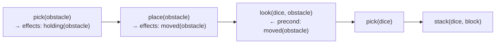

# PDDL 設計の落とし穴

TAMPURA 環境を実装するとき、プランナー（Symk）の動作を正しく理解していないと「アクションは実装できたのにプランが生成されない」「意図しない行動を繰り返す」という問題に直面する。このドキュメントでは、特定のフレームワークに依存しない PDDL 設計上の注意点をまとめる。

---

## ゴール述語は必ずアクションの `effects` に含める

プランナーはアクションの `effects` フィールドだけを参照して「どの述語に到達できるか」を解析する。いくら `abstract()` メソッドで計算していても、**どのアクションの effects にも登場しない述語**はプランナーの到達可能集合に入らない。

### 何が起きるか

```python
# abstract() で target-stacked を計算しているが…
reward = Atom("target-stacked")   # ← どのアクションにも effects として登場しない
```

このとき Symk は「`target-stacked` に至る経路が存在しない」と判断し、毎ステップ planning に失敗する。no-op のみが選択され続ける症状として現れる。

### 2 通りの解決策

**A. 既存 effects の組み合わせとして目標を定義する**

`on`・`is-target-dice`・`is-target-block` など、すでに何らかのアクションの effects に登場している述語だけを使って目標を組み立てる。

```python
reward = Exists(
    And([
        Atom("is-target-dice",  ["?top"]),
        Atom("is-target-block", ["?bottom"]),
        Atom("on",              ["?top", "?bottom"]),
    ]),
    ["?top", "?bottom"],
    ["physical", "physical"],
)
```

**B. 目標述語を明示的にアクションの effects に追加する**

```python
ActionSchema(
    name="stack",
    ...
    effects=[Atom("on", ["?top", "?bottom"]), Atom("target-stacked")],
)
```

---

## Symk は常に最短プランを返す：誤った短プランを preconditions で排除する

Symk は cost-optimal なプランを返す。前提条件の設計が甘いと**実行不可能な短プラン**が選ばれ、実行時に毎回失敗する。

### 何が起きるか（`find_block_stack_dice` の例）

障害物の下にダイスが隠れているシーンで、初期 belief に `known-pose(target_dice)` が含まれると、Symk は次のプランを返す。

```
# Symk が選ぶ最短プラン（2 ステップ）
pick(target_dice) → stack(target_dice, block)
```

しかし現実には障害物がダイスの上に乗っており、`pick` はコリジョン検出で毎回失敗する。プランナーは学習リセット設定（`from_scratch: true`）により失敗から学ばず、同じプランを選び続ける。

正しいプランは次の 4 ステップである。

```
pick(obstacle) → place(obstacle) → look(dice, obstacle) → pick(dice) → stack(dice, block)
```

### 設計の原則：間違った短プランを PDDL 段階で排除する

正しい実行順序を強制するには、「そのアクションが本当に適用可能になる条件」を preconditions で厳密に記述する。具体的には、「前のアクションが effects として残した述語」を次のアクションの precondition に加える。

```python
# look アクションの preconditions に追加
preconditions=[
    Atom("moved",        ["?o2"]),        # 障害物が移動済みでなければ look 不可
    Atom("hidden-under", ["?o1", "?o2"]), # ?o2 が ?o1 を覆っていた事実が必要
    ...
]
```

この設計により：

- `look(dice, obstacle)` → precondition に `moved(obstacle)` が必要
- `moved(obstacle)` → `place(obstacle)` の effect
- `place(obstacle)` → precondition に `holding(obstacle)` が必要
- `holding(obstacle)` → `pick(obstacle)` の effect



Symk はこの制約に沿った最短プランを自動で見つける。

---

## 永続的な事実と一時的な事実を区別する

PDDL の述語には2種類ある。

| 種類 | 特徴 | 例 |
|------|------|-----|
| 一時的な述語 | アクションの effects で追加・削除される | `holding(obj)`、`on(a, b)` |
| 永続的な述語 | 一度成立したら変化しない構造的事実 | `is-target-dice(obj)`、`hidden-under(dice, obs)` |

「初期化時に隠れていた」という事実は、障害物が移動しても消えてほしくない（`look` の参照先を永続的に指定するために必要）。このような事実には、どのアクションの effects にも `Not(...)` として登場しない述語を使う。

```python
# hidden-under はどのアクションも削除しない
# → 一度成立したら永続的に保持される
Predicate("hidden-under", ["physical", "physical"]),
```

これを `abstract()` が毎回返すことで、実行中ずっとプランナーが参照できる状態になる。
