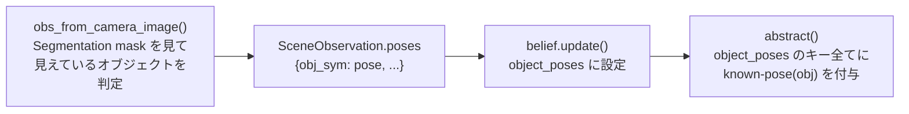

# TAMPURA フレームワーク内部の仕組み

新しい TAMPURA 環境を実装するとき、フレームワークがどのように「物理世界 → 抽象 belief → プランナー → 実行」をつないでいるかを知らないと、思わぬ場所でハマる。このドキュメントでは TAMPURA 固有の内部動作とよくある落とし穴をまとめる。

---

## 環境の登録：`register_env` はモジュールが import されて初めて実行される

`env.py` のモジュールレベルに書く `register_env("my_env", MyEnvClass)` は、そのファイルが import されて初めて実行される。`tampura_environments/__init__.py` に import を追加しないと実行されない。

```python
# tampura_environments/__init__.py に追記する
from .my_env.env import *
```

忘れると実験開始直後に `KeyError: 'my_env'` が発生する。

---

## `known-pose` はどこから来るか：obs_from_camera_image → abstract() のパイプライン

PDDL の `known-pose(obj)` は次のパイプラインで決まる。



「初期状態でこのオブジェクトは見えていない（hidden）」にしたい場合は、`obs_from_camera_image` で明示的に除外する。PyBullet の segmentation mask は物理的に見えていなくても ID として検出される場合があるため、座標ベースの判定が必要になることがある。

```python
# 障害物に覆われているダイスを SceneObservation から除外する例
if cat in ("target_dice", "distractor_dice") and obstacle_centers:
    dx, dy, dz = gt_pose[0]
    if any(
        abs(ox - dx) < x_tol and abs(oy - dy) < y_tol and oz > dz + top_margin
        for ox, oy, oz in obstacle_centers
    ):
        continue  # 隠れているので known-pose に入れない
```

---

## 永続的な belief を保持する：`initially_covered` パターン

`abstract()` が物理状態から毎回再計算する述語は、物理状態が変化すると自動的に消える。しかし「初期化時にこのダイスはこの障害物に覆われていた」という構造的事実は、障害物が移動した後も保持したい場合がある。

このような永続的な事実は `Belief` クラスのフィールドとして持ち、`abstract()` で毎回 belief items に追加する。

```python
class SceneBelief(Belief):
    def __init__(self, ...):
        ...
        self.initially_covered: Dict[str, str] = {}   # dice_sym → obs_sym

    def abstract(self, store):
        ...
        # 障害物が移動しても hidden-under は消えない
        for dice_sym, obs_sym in self.initially_covered.items():
            ab.items.append(Atom("hidden-under", [dice_sym, obs_sym]))
```

`belief.update()` は内部で `copy.deepcopy(self)` を使っているため、フィールドを追加するだけで引き継がれる。`update()` に追記は不要。

`initialize()` の中で一度だけ設定する：

```python
for dice_sym, dice_cat in zip(self.sim_world.objects, self.sim_world.categories):
    if dice_sym not in b.object_poses and dice_cat in ("target_dice", "distractor_dice"):
        # どの obstacle が上に乗っているかを座標から計算して記録
        b.initially_covered[dice_sym] = obs_sym
```

---

## `ActionSchema.depends` は Symk プランニングに影響しない

`depends` フィールドは Bayesian 遷移モデルの例外追跡（`closed_fluents` 経由）に使われる。Symk はこのフィールドを参照しない。

```python
ActionSchema(
    name="look",
    depends=[Atom("moved", ["?o2"])],  # ← Symk は見ない
    preconditions=[...],               # ← Symk はこちらだけを見る
)
```

アクションの実行順序を Symk に強制したい場合は `preconditions` に記述する。`depends` に書いても計画は変わらない。

---

## `pick_effects_fn` とシミュレーション世界の同期

`pick_effects_fn` での IK 判定はシミュレーション世界で行われる。`belief.set_sim(store)` を呼ぶと、`belief.object_poses` に基づいてすべてのオブジェクトがシム世界に配置される。障害物が `object_poses` に含まれていれば、障害物も正しい位置に配置されて `grasp_ik` はコリジョンを検出できる。

```python
def pick_effects_fn(action, belief, store, **kwargs):
    ...
    belief.set_sim(store)   # ← ここでシム世界が現在の belief に同期される
    pre_confs = grasp_ik(
        belief.world,
        store.get(obj),
        belief.get_pose(obj),
        g,
        obstacles=[...],
    )
    # 障害物がダイスの上にある場合、grasp_ik は None を返す（コリジョン検出）
```

ただし `effects_fn` が failure を返す（同じ abstract belief を返す）だけでは、`from_scratch: true` 環境では毎ステップ学習がリセットされるため失敗経験が蓄積されない。根本解決には PDDL 前提条件でプランニング段階から排除する設計が必要（[pddl_design.md](pddl_design.md) 参照）。

---

## grasp 関連の落とし穴

### `get_top_and_bottom_grasps` は `Grasp` オブジェクトではなく raw pose tuple を返す

`pbu.get_top_and_bottom_grasps()` が返すのは `(position, quaternion)` のタプルであり、`grasp_ik` が要求する `.pregrasp` 属性を持つ `Grasp` オブジェクトではない。

実際の環境では stream 内の `get_grasp()` が `Grasp(obj, grasp_pose, ...)` としてラップするため、stream を経由して取得した `Grasp` オブジェクトが store に保存される。デバッグ用スクリプトなどで `get_grasp_candidates()` の戻り値を直接 `grasp_ik` に渡すと `AttributeError: 'tuple' object has no attribute 'pregrasp'` が発生する。

### `pbu.get_oobb` は存在しない

`pb_utils.py` には `get_oobb()` 関数が存在しない（`OOBB` クラスと `get_oobb_vertices` 関数はある）。オブジェクトの境界ボックスが必要な場合は次のように取得する。

```python
aabb = pbu.get_aabb(obj, client=client)
pose = pbu.get_pose(obj, client=client)
cand = pbu.get_top_and_bottom_grasps(obj, aabb, pose, tool_pose=TOOL_POSE, grasp_length=0.01)
```

---

## PyBullet の body ID は real world と sim world で一致する

`pybullet.connect(pybullet.DIRECT)` を呼ぶたびに独立した physics server が作られ、body ID は 0 から採番される。real world と sim world で**同じ順序でオブジェクトを作成**すると body ID が一致する。

これにより `store.get(obj_sym)`（sim world の ID）と segmentation mask の ID（real world の ID）が同じ値になり、`obs_from_camera_image` での照合が機能する。オブジェクトの作成順序を揃えることが前提となる。

---

## `flat_stream_sample` はエピソード中に 1 回だけ実行される

`tampura_policy.py` の `self.sampled` フラグにより、`flat_stream_sample` はエピソード中に一度だけ実行される。`from_scratch: true` でも `self.sampled` はリセットされない。

```python
if not self.sampled and len(self.problem_spec.stream_schemas) > 0:
    store = self.problem_spec.flat_stream_sample(ab, store=store, times=sample_width)
    self.sampled = True
```

grasp の向きや placement pose など stream のサンプリングで決まるパラメータは初回のみ決定される。サンプリングの多様性が必要な場合は設定の `flat_width` を増やす。

---

## 動作がおかしい場合のデバッグ手順

TAMPURA の動作がおかしいとき、問題は「Symk が計画を作れていない」「belief が想定と違う」「実行時に失敗している」の3層のどこかにある。

**1. Symk が計画を見つけているか確認する**

ログの `Solutions (N):` 行を確認する。`Solutions (0):` なら Symk が目標に到達できないと判断している（goal 述語が effects に存在しないか、preconditions が矛盾している）。

**2. 初期の abstract belief に期待する述語があるか確認する**

```
Abstract Belief: AbstractBelief(items=[...])
```

例えば `known-pose(target_dice)` が初期から含まれていれば、hidden にする処理が `obs_from_camera_image` で漏れている。

**3. `pick_effects_fn` が success を返しているか確認する**

logging.DEBUG を有効にして各 effects_fn の戻り値を確認する。

**4. 同じアクションを繰り返しているか確認する**

これは `from_scratch: true` + PDDL 設計ミスの典型的な症状。一時的に `from_scratch: false` にすると学習が蓄積されて症状が変化し、原因の切り分けに役立つ。ただし根本解決には PDDL を修正する。
